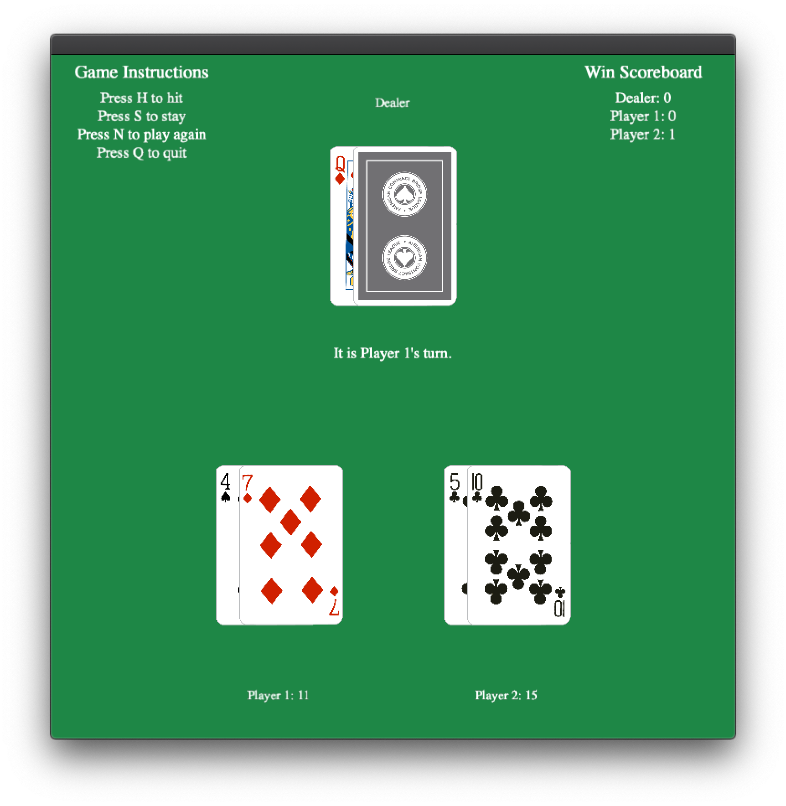

# Blackjack

This game is a C++ Graphical Application using the [**Cinder**](https://libcinder.org/) library to help facilitate graphics.

**This project Requires Cinder, CMake, and any C++ compiler in order to compile and run**

## Playing the game

For the most part, the game is extremely explanatory and gives on screen instructions as to the controls and whose turn it is.
This game is played by using keyboard input, and multiplayer mode is supported up to 4 players.

### Controls

These are the controls used while playing the game:

| Key       | Action                               |
|---------- |--------------------------------------|
| `h`       | Hit                                  |
| `s`       | Stay                                 |
| `q`       | Quit game and return to home screen  |
| `n`       | New Hand with same players           |

An example of a game being played can be seen below:

------
### Blackjack Rules

For a deeper explanation of the rules of Blackjack, you can visit [*this website*](https://bicyclecards.com/how-to-play/blackjack/).

-----
*Last Updated April 3, 2021. Nick King, CS126, University of Illinois at Urbana-Champaign.*